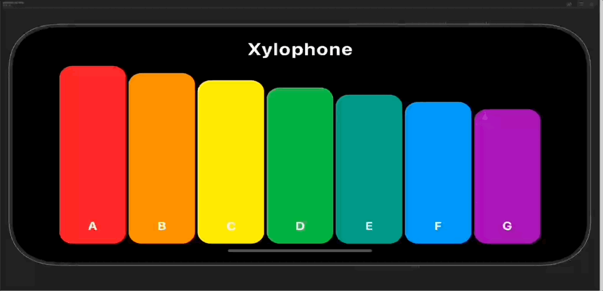

# xylophone

Xylophone app, developed as a part of App-brewery course

### Features
- highlights the key being played
- can play multiple keys i.e. multiple tap because each key has its own "AudioPlayer"
- Sets Xylophone Bar height in descending order
- Labels each key with specific note
- Uses the "note" parameter to select the specific note to play for the bar, matching its label

**PS:** notes are not exactly same, i have only labeled them from note A to G, if someone with better 
ears and, understanding of music let me know correct order, that be great

### Demo

